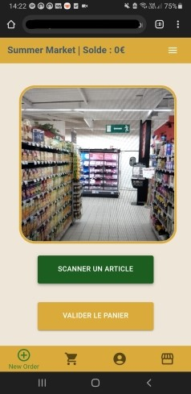
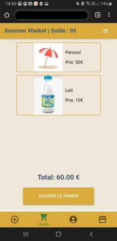

# Summer-Market

Summer Market est une application web pour prendre des commandes dans un supermarché.

En supposant que les produits en magasin ont un QR code associé, l'utilisateur peut scanner ces codes
pour ajouter l'article à son panier et ainsi passer sa commande totalement sur son téléphone.

---

## Fonctionnalités :

- Rendu adapté pour téléphone et ordinateur
- Inscription et authentification des utilisateurs
- Scanner de QR code intégré
- Ajout et sauvegarde des produits dans le panier
- Passage de commande
- Mise à jour du stock et des paniers en temps réel avec la base de données
- Ajout de crédit virtuel pour acheter ses produits
- Génération de nouveaux produits (et leurs QR codes) depuis la partie admin

## Capture d'écran :

  

## Architecture  :

Le projet est une application web basée sur NodeJS. Le front-end est réalisé avec React, et les requêtes vers le back-end s'effectuent avec Axios. Le serveur est lui fait avec Express.js, tandis que les données sont stockées dans une base de données NoSQL avec MongoDB hébergé à distance et manipulé grâce à MongoDB ATLAS.

---

## Installation :

Copiez le code avec la commande : `git clone https://github.com/CyprienKelma/Summer-Market.git`

## Utilisation

Ce dépôt contient à la fois l'appli web (dans le dossier `client`) et le serveur Express (dans le dossier `server`).

### Lancer l'appli web :

1. Ouvrez un terminal et rendez-vous dans le dossier client : `cd client`

2. Si ce n'est pas déjà fait, installez Node.js et récupérez les bibliothèques avec : `npm install`

3. Allez dans le dossier build : `cd build`

4. Créez un build local : `npm run build-https`

5. Revenez dans le fichier client (avec `cd ..`) et lancez le projet : `($env:HTTPS = "true") -and (npm start)`

6. Si la page ne s'est pas lancée automatiquement, allez sur le lien : `https://localhost:3000/order`

### Lancer le serveur Express :

1. Ouvrez un nouveau terminal et rendez-vous dans le dossier server : `cd server`

2. De même, veillez à avoir Node.js installé et récupérez les bibliothèques du back-end avec : `npm install`

3. Créez un fichier `.env` et mettez-y votre lien vers la base de données, sous la forme : `MONGO_URI=mongodb+srv://[your username]:[your password]@[your DB name].gog9niz.mongodb.net`

4. Ouvrez le fichier `ipconfig.js` dans `client/src` et modifiez les paramètres en suivant les instructions :

   

6. Revenez sur le terminal et lancez le serveur (assurez-vous d'être dans le dossier server) : `npm run start`
